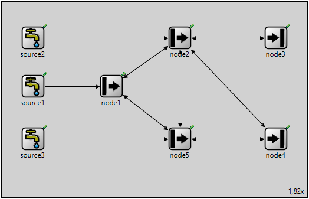
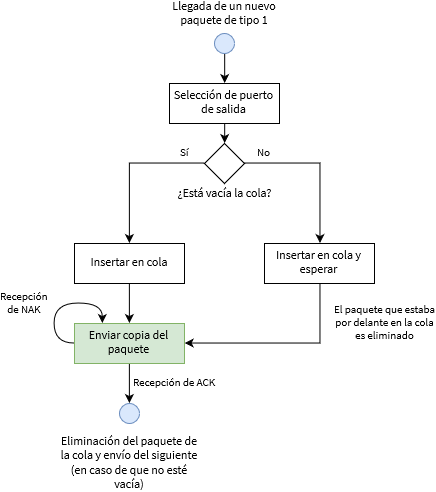

# Simulación de equipos y protocolos con OMNeT++

> *Proyecto realizado para la asignatura **Rendimiento en redes de telecomunicación** del Máster en Ingeniería de Telecomunicación de la UPV/EHU.*

## 🌐 Descripción general
Se ha implementado la red de colas propuesta haciendo uso del protocolo *Stop & Wait*. Esta implementación se ha realizado mediante OMNeT++ creando tres tipos de nodos:

* `Source`: tres nodos que generan un número determinado de paquetes siguiendo una distribución exponencial para el tiempo de llegadas.
* `NetworkNode`: nodos intermedios, encargados de recibir paquetes y enviarlos por una de sus salidas, en base a una probabilidad establecida previamente.
* `EndNode`: nodos finales, encargados únicamente de recibir los paquetes que les llegan a través de la red.

Estos tres módulos han sido creados a partir del objeto ya existente en OMNeT++, `cSimpleModule`. Además, se ha utilizado el módulo `DatarateChannel` para especificar un datarate concreto, además de la probabilidad de errores para el canal (a través del PER) y el retardo del mismo.

Cada enlace entre dos nodos está formado por dos canales, cada uno de ellos con un sentido, mientras que entre fuentes y nodos existe un único canal unidireccional para la transmisión de paquetes hacia los nodos. Se presupone que el canal entre fuentes y nodos es un canal perfecto, que no añade retardo ni errores y, por lo tanto, no necesita confirmación del nodo destino, puesto que siempre llegarán en perfecto estado.

## 🔴 Fichero NED



El fichero NED contiene las conexiones descritas previamente, así como el número de puertos de entrada y salida que contiene cada nodo, teniendo en cuenta todos los canales indicados. Estos puertos son creados en forma de *gate array*, es decir, un vector de puertos, con una longitud específica para cada uno de los nodos, ya que no todos ellos tienen el mismo número de enlaces. Además, se ha añadido el parámetro *probability* para los nodos intermedios, de tal forma que la probabilidad de que éstos reenvíen los paquetes hacia un camino u otro queda definida en este fichero. Más adelante, este parámetro será utilizado en los ficheros C++ para realizar ese reenvío.

## 📦 Objeto `CustomPacket`

El objeto utilizado en las transmisiones es un objeto personalizado que hereda de las clases `cMessage` y `cPacket`, denominado `CustomPacket`. Este objeto se puede definir de forma simple, de la siguiente forma:
```
packet CustomPacket {
	int fromSource = false;
	int sequenceNumber;
	int origin;
}
```
Mediante el número de secuencia y el origen, se permite identificar de forma unívoca al paquete en cualquier punto de la red. El tercer parámetro, `fromSource`, es un parámetro de control interno utilizado en los nodos intermedios para facilitar la lógica y reenviar directamente los paquetes que llegan de las fuentes.

De cara a realizar la conversión entre este tipo de objeto y el tipo `cMessage` utilizado por OMNeT+ en los canales, se realiza lo siguiente al recibir un mensaje o paquete en cualquier nodo:
```
CustomPacket *pkt = check_and_cast<CustomPacket *> (msg);
```
Por último, se utiliza el atributo `kind` disponible en la clase `cMessage` para definir tres tipos de paquetes: un paquete normal (1), un ACK (2) o un NAK (3).

## ⛲ Módulo `Source`

Este módulo tiene dos funciones principales: la generación de paquetes y el envío de dichos paquetes, distribuyéndolos en el tiempo de forma exponencial. La generación de paquetes consiste únicamente en rellenar correctamente los campos definidos previamente para el objeto `CustomPacket`, añadiendo números de secuencia de forma ascendente y nombres también unívocos para realizar más fácilmente el seguimiento de los eventos. Respecto a la distribución exponencial, se han utilizado diversas funciones de C++ para la generación de números aleatorios y la función matemática utilizada con anterioridad para la generación de distribuciones exponenciales:
```
std::uniform_real_distribution<double> randomReal(0.0, 1.0);
std::default_random_engine generator(time(NULL));
std::vector<double> departures(samples);
for(int i = 0; i < departures.size(); i++) {
    double randomNumber = randomReal(generator);
    double number = (-1/lambda) * log(randomNumber);
    if (i != 0)
        departures[i] = departures[i - 1] + number;
    else
        departures[i] = number;
}
return departures;
```
En la inicialización del módulo, se obtiene un vector de tiempos de salida (de la fuente) y se programan todos los paquetes para esos tiempos mediante la función `scheduleAt()`. Esta función no envía directamente los paquetes al siguiente nodo, lo que hace es generar un evento en el propio módulo, que es cazado mediante la función `handleMessage()`, recibiendo como parámetro el paquete a enviar. Por este motivo, es en esta función donde debe declararse el envío del paquete mediante la función `send()`, indicando también el puerto por el que se debe enviar. También durante la inicialización se obtiene un vector de longitudes variables, distribuidas de forma exponencial en base a la media obtenida del parámetro `meanPacketLength`, asignándose estas longitudes a los paquetes a medida que se generan.

## 🔀 Módulo `NetworkNode`

Este módulo es el de mayor complejidad, donde reside la lógica de recepción, comprobación y reenvío de paquetes. Durante su inicialización obtiene, de los puertos de salida, los canales por los que retransmitirá los paquetes que reciba, y crea una cola de salida para cada uno de ellos. A su vez, obtiene del fichero NED la probabilidad asignada en cada caso a la hora de tener que rutar los paquetes recibidos.

En función del tipo de paquete que llegue, las funciones a realizar son unas u otras. En el caso de paquetes de tipo 1, se usa la función `hasBitError()` para comprobar si se ha producido algún error durante la transmisión. En caso de que haya errores, se envía un NAK al nodo origen y se descarta el paquete.

Para el caso del paquete de tipo 1 que no contenga errores, las acciones a realizar se pueden resumir con el siguiente diagrama:



Una vez se ha seleccionado el puerto de salida mediante una función aleatoria que tiene en cuenta la probabilidad asignada, se comprueba si la cola está vacía o no. Si está vacía, se procede a enviar el paquete (en realidad, una copia del mismo), y en caso contrario, se espera. En cualquiera de los casos, el paquete se añade a la cola, ya que puede ser necesario reenviarlo si se recibe un NAK por parte del siguiente nodo. El paquete es eliminado de la cola cuando se recibe un ACK<sup>1</sup> por parte del siguiente nodo, y es en ese momento en el que puede enviarse el siguiente paquete que se encontrase a la espera.

Habiendo comprendido el comportamiento cuando se recibe uno de estos paquetes, es sencillo entender qué ocurre cuando llegan paquetes de tipo ACK o NAK. En el primero de los casos, como ya se ha mencionado, simplemente se elimina el paquete que quedaba en la cola del canal por el que se ha recibido el ACK y se procede a enviar el siguiente, siempre que la cola no esté vacía. En el caso del NAK, únicamente se coge el primer paquete de la cola y, sin eliminarlo de la misma, se vuelve a enviar.

> **<sup>1</sup>** Los ACK, del mismo modo que los NAK, pueden llegar por distintos puertos de entrada. Para facilitar las comprobaciones y operaciones que se han de realizar, se asigna el mismo índice para el canal de salida y de entrada de un mismo enlace en cada nodo. Por ejemplo, en el nodo 1, existe un puerto de salida con índice 0 para enviar paquetes al nodo 2 y un puerto de entrada con índice 0 para recibir paquetes de dicho nodo.

## 💻 Módulo `EndNode`

Es una simplificación del caso anterior que no reenvía paquetes. Se limita a procesar los paquetes de tipo 1 y confirmar su recepción mediante un ACK o rechazarla mediante un NAK.

## 🔮 Funciones a implementar

*  En este instante, no se contemplan las pérdidas de paquetes, y el reenvío por parte de un nodo solo se produce si el siguiente le indica que ha sido recibido con un error, mediante un NAK. Una posible mejora a implementar son temporizadores que permitan a los nodos reenviar los paquetes cuando pasa un determinado tiempo, dando por supuesto que se han perdido.
*  Además del campo de origen ya establecido en el paquete, añadir un campo que permita establecer circuitos virtuales y así los nodos puedan utilizar esta información, junto a algún tipo de tablas de encaminamiento a implementar, para poder realizar tareas de conmutación en cada nodo.

